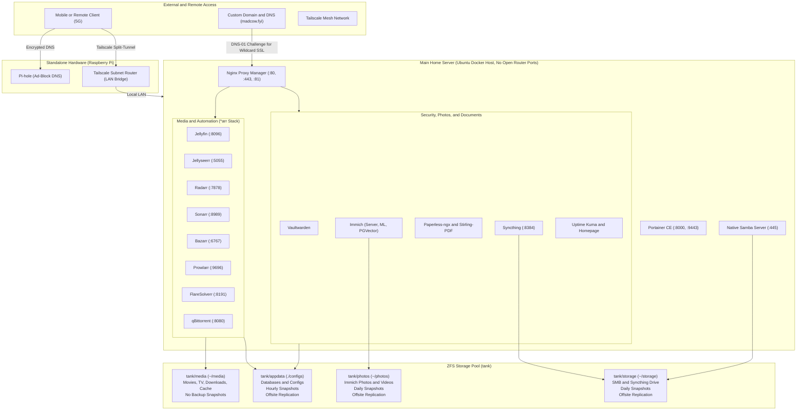

# Automated Homelab and Media Server

This repository holds a homelab setup that runs on Docker Compose and native Linux services. The design uses ZFS snapshots, atomic hardlinks (TRaSH Guides), and an SSL reverse proxy with no open router ports. It also includes a Samba network drive, Syncthing file sync, and an isolated DNS and VPN node.

---

## Architecture Overview


```mermaid
flowchart TD
    subgraph Internet ["External and Remote Access"]
        Client["Mobile or Remote Client (5G)"]
        DomainDNS["Custom Domain and DNS (madcow.fyi)"]
        TailscaleNet["Tailscale Mesh Network"]
    end

    subgraph Hardware_Pi ["Standalone Hardware (Raspberry Pi)"]
        PiHole["Pi-hole (Ad-Block DNS)"]
        PiTailscale["Tailscale Subnet Router (LAN Bridge)"]
    end

    subgraph HomeServer ["Main Home Server (Ubuntu Docker Host, No Open Router Ports)"]
        NPM["Nginx Proxy Manager (:80, :443, :81)"]
        Portainer["Portainer CE (:8000, :9443)"]
        SMB["Native Samba Server (:445)"]

        subgraph Core_Services ["Security, Photos, and Documents"]
            Vault["Vaultwarden"]
            Immich["Immich (Server, ML, PGVector)"]
            Paperless["Paperless-ngx and Stirling-PDF"]
            Sync["Syncthing (:8384)"]
            Monitor["Uptime Kuma and Homepage"]
        end

        subgraph Media_Stack ["Media and Automation (*arr Stack)"]
            Jellyfin["Jellyfin (:8096)"]
            Jellyseerr["Jellyseerr (:5055)"]
            Radarr["Radarr (:7878)"]
            Sonarr["Sonarr (:8989)"]
            Bazarr["Bazarr (:6767)"]
            Prowlarr["Prowlarr (:9696)"]
            Flare["FlareSolverr (:8191)"]
            Qbit["qBittorrent (:8080)"]
        end
    end

    subgraph Storage ["ZFS Storage Pool (tank)"]
        DS_Appdata["tank/appdata (./configs)\nDatabases and Configs\nHourly Snapshots\nOffsite Replication"]
        DS_Photos["tank/photos (~/photos)\nImmich Photos and Videos\nDaily Snapshots\nOffsite Replication"]
        DS_Storage["tank/storage (~/storage)\nSMB and Syncthing Drive\nDaily Snapshots\nOffsite Replication"]
        DS_Media["tank/media (~/media)\nMovies, TV, Downloads, Cache\nNo Backup Snapshots"]
    end

    Client -->|Tailscale Split-Tunnel| PiTailscale
    PiTailscale -->|Local LAN| HomeServer
    Client -->|Encrypted DNS| PiHole
    DomainDNS -->|DNS-01 Challenge for Wildcard SSL| NPM

    NPM --> Core_Services
    NPM --> Media_Stack

    SMB --> DS_Storage
    Sync --> DS_Storage
    Immich --> DS_Photos
    Core_Services --> DS_Appdata
    Media_Stack --> DS_Appdata
    Media_Stack --> DS_Media
```

---

## Services Directory

| Category | Service | Container Port | Host Port | Access URL | Purpose |
| :--- | :--- | :--- | :--- | :--- | :--- |
| **Proxy and Admin** | [Nginx Proxy Manager](https://nginxproxymanager.com) | `80`, `443`, `81` | `80:80`, `443:443`, `81:81` | `http://<ip>:81` | SSL termination and reverse proxy |
| | [Portainer CE](https://www.portainer.io) | `8000`, `9443` | `8000:8000`, `9443:9443` | `https://<ip>:9443` | Web interface for Docker containers |
| **Storage and Drive** | [Samba (Native SMB)](https://www.samba.org) | Host Native | `445`, `139` | `smb://<server-ip>/HomeDrive` | Local network drive |
| | [Syncthing](https://syncthing.net) | `8384` | `8384:8384` | `http://<ip>:8384` | File sync and offline drive |
| **Security** | [Vaultwarden](https://github.com/dani-garcia/vaultwarden) | `80` | Via NPM | `https://vault.<domain>` | Self-hosted Bitwarden password vault |
| **Photos and Documents** | [Immich](https://immich.app) | `2283` | `2283:2283` | `http://<ip>:2283` | Self-hosted photo and video backup |
| | [Paperless-ngx](https://docs.paperless-ngx.com) | `8000` | `8777:8000` | `http://<ip>:8777` | Document archive and OCR system |
| | [Stirling-PDF](https://github.com/Stirling-Tools/Stirling-PDF) | `8080` | `8085:8080` | `http://<ip>:8085` | Local PDF tool suite |
| **Monitoring** | [Uptime Kuma](https://github.com/louislam/uptime-kuma) | `3001` | `3001:3001` | `http://<ip>:3001` | Service status monitor |
| | [Homepage](https://gethomepage.dev) | `3000` | `3000:3000` | `http://<ip>:3000` | Application dashboard |
| **Media Automation** | [Jellyfin](https://jellyfin.org) | `8096` | `8096:8096` | `http://<ip>:8096` | Open-source media server |
| | [Jellyseerr](https://github.com/Fallenbagel/jellyseerr) | `5055` | `5055:5055` | `http://<ip>:5055` | Media request interface |
| | [Radarr](https://radarr.video) | `7878` | `7878:7878` | `http://<ip>:7878` | Movie collection manager |
| | [Sonarr](https://sonarr.tv) | `8989` | `8989:8989` | `http://<ip>:8989` | TV series collection manager |
| | [Bazarr](https://www.bazarr.media) | `6767` | `6767:6767` | `http://<ip>:6767` | Subtitle manager for Sonarr and Radarr |
| | [Prowlarr](https://prowlarr.com) | `9696` | `9696:9696` | `http://<ip>:9696` | Torrent and Usenet indexer proxy |
| | [qBittorrent](https://www.qbittorrent.org) | `8080`, `6881` | `8080:8080`, `6881:6881` | `http://<ip>:8080` | Torrent download client |
| | [FlareSolverr](https://github.com/FlareSolverr/FlareSolverr) | `8191` | `8191:8191` | `http://<ip>:8191` | Cloudflare solver for indexers |

---

## Storage Architecture and ZFS Dataset Layout

The storage layout separates critical application state, personal photos, personal documents, and disposable media into four ZFS datasets:

```
ZFS Storage Pool (tank)
├── tank/appdata (Mounted to ./configs inside ~/home-lab)
│   ├── Settings, SQLite databases (Vaultwarden, Sonarr, Radarr, Prowlarr)
│   ├── Immich PostgreSQL database & pgvector data
│   ├── Paperless SQLite metadata & NPM certificates
│   └──> SNAPSHOT THIS! (Lightweight, ~5-20 GB, hourly snapshots, replicated offsite)
│
├── tank/photos (Mounted to ~/photos)
│   ├── Immich photo and video libraries (family memories)
│   └──> SNAPSHOT & BACKUP THIS! (Daily snapshots, replicated offsite)
│
├── tank/storage (Mounted to ~/storage)
│   ├── Native Samba SMB share (Live network drive)
│   ├── Syncthing storage folder (Offline laptop sync)
│   └──> SNAPSHOT & BACKUP THIS! (Daily snapshots, replicated offsite)
│
└── tank/media (Mounted to ~/media)
    ├── downloads/       (qBittorrent active & completed downloads)
    ├── movies/          (Curated movie library)
    ├── tv/              (Curated TV show library)
    └── cache/
        ├── jellyfin/    (Transcoding chunks & image cache)
        └── immich-ml/   (Downloaded machine learning model cache)
    └──> EXCLUDED FROM BACKUP SNAPSHOTS (Multi-terabyte disposable media)
```

---

## Setup Procedure

### Step 1: Install Host System Packages

1. On a new Ubuntu Server installation, run these commands to update packages and install Docker, ZFS, and Samba:

```bash
# Update system packages
sudo apt update && sudo apt upgrade -y

# Install Docker engine and Compose plugin
curl -fsSL https://get.docker.com | sh
sudo usermod -aG docker $USER

# Install ZFS utilities and Samba
sudo apt install -y zfsutils-linux samba

# Apply docker group change to current session
newgrp docker

# Check installations
docker --version
docker compose version
zfs --version
```

2. Run these commands to check your user UID and GID:

```bash
id -u  # Expected: 1000
id -g  # Expected: 1000
```

3. If your UID or GID is not `1000`, update `PUID` and `PGID` in the `.env` file.

---

### Step 2: Make the ZFS Pool

1. List your storage drives by their persistent disk IDs so drive names stay consistent after a reboot:

```bash
ls -l /dev/disk/by-id/
```

2. Make the ZFS storage pool named `tank`:

```bash
# For a two-drive mirror setup (recommended):
sudo zpool create -o ashift=12 -O compression=lz4 tank mirror \
    /dev/disk/by-id/<drive-1-id> \
    /dev/disk/by-id/<drive-2-id>

# For a single-drive setup:
# sudo zpool create -o ashift=12 -O compression=lz4 tank /dev/disk/by-id/<drive-id>

# Check pool status
sudo zpool status tank
```

---

### Step 3: Clone the Repository

1. Clone this repository into your home directory before you make the ZFS dataset mountpoints:

```bash
git clone <your-repo-url> ~/home-lab
cd ~/home-lab
```

---

### Step 4: Prepare Storage Datasets and Directories

1. Run these commands to make the ZFS datasets, media subdirectories, and user permissions:

```bash
# 1. Appdata dataset (databases and container state: atime off, system attributes on)
sudo zfs create -o compression=lz4 -o atime=off -o xattr=sa -o mountpoint=/home/$USER/home-lab/configs tank/appdata

# 2. Photos dataset (Immich photo and video libraries: backed up)
sudo zfs create -o compression=lz4 -o atime=off -o mountpoint=/home/$USER/photos tank/photos

# 3. Personal storage dataset (SMB share and Syncthing offline drive: backed up)
sudo zfs create -o compression=lz4 -o atime=off -o mountpoint=/home/$USER/storage tank/storage

# 4. Bulk media dataset (1M recordsize for video streams: not backed up)
sudo zfs create -o compression=lz4 -o recordsize=1M -o mountpoint=/home/$USER/media tank/media

# 5. Make media subdirectories and isolated transcode caches
mkdir -p ~/media/downloads
mkdir -p ~/media/movies
mkdir -p ~/media/tv
mkdir -p ~/media/cache/jellyfin
mkdir -p ~/media/cache/immich-ml

# 6. Give ownership of all datasets to your user
sudo chown -R $USER:$USER /home/$USER/home-lab/configs /home/$USER/photos /home/$USER/storage /home/$USER/media
```

---

### Step 5: Set Up Personal Cloud Storage (SMB and Syncthing)

Both the Samba network drive (SMB) and offline file sync (Syncthing) use the same ZFS dataset (`~/storage`).

#### A. Set Up Samba (SMB Share)

1. Open `/etc/samba/smb.conf`:

```bash
sudo nano /etc/samba/smb.conf
```

2. Add this share block to the bottom of the file:

```ini
[HomeDrive]
    comment = Personal Cloud Storage (ZFS)
    path = /home/%u/storage
    read only = no
    browsable = yes
    valid users = %u
    create mask = 0664
    directory mask = 0775
```

> [!NOTE]
> The `%u` macro expects the client username to match the Linux username. If a client uses a different username, replace `%u` with your Linux username (for example, `username`).

3. Set your Samba password and restart the Samba service:

```bash
sudo smbpasswd -a $USER
sudo systemctl restart smbd
```

4. Connect to the share from Windows (`\\<server-ip>\HomeDrive`), macOS (`smb://<server-ip>/HomeDrive`), or a mobile file app.

#### B. Set Up Syncthing (Offline Sync)

1. Open `http://<server-ip>:8384`.
2. Install the Syncthing client on your laptop.
   * Syncthing maps `/storage` directly to `~/storage`.
   * When your laptop connects to the network, Syncthing sends changes to the server.
   * ZFS snapshots then protect the updated files.
3. In the Syncthing folder settings, add these lines to **Ignore Patterns** (`.stignore`) so OS metadata files do not sync:
   ```
   (?d).DS_Store
   (?d)Thumbs.db
   (?d)._*
   (?d).sync
   ```

---

### Step 6: Set Up Environment Variables and Dashboard Templates

1. Copy the environment template file and restrict its permissions:

```bash
cd ~/home-lab
cp example.env .env
chmod 600 .env
```

2. Open `.env` in an editor:

```bash
nano .env
```

3. Set these variables in `.env`:
   * `SERVER_IP`: Local LAN IP address of your server (for example, `192.168.0.100`).
   * `IMMICH_DB_PASSWORD`: Random password made with `openssl rand -hex 16`.
   * `PAPERLESS_SECRET_KEY`: Random secret key made with `openssl rand -hex 16`.
   * `VAULTWARDEN_DOMAIN`: Public URL (for example, `https://vault.madcow.fyi/`).
   * `VAULTWARDEN_SIGNUPS_ALLOWED`: Set to `true` only to register your admin account, then set back to `false`.
   * `DUCKDNS_KEY`: Your DuckDNS account token for the DNS-01 SSL challenge in NPM.

4. Copy the starter templates for Homepage into the config directory:

```bash
mkdir -p ./configs/homepage/config
cp -r templates/homepage/* ./configs/homepage/config/
```

---

### Step 7: Start the Stack

1. Check the Compose syntax, start all containers, and check their status:

```bash
# Check compose syntax
docker compose config

# Start all containers in detached mode
docker compose up -d

# Check container status
docker compose ps
```

---

### Step 8: Set Up Nginx Proxy Manager and SSL (Private LAN Access)

> [!NOTE]
> This setup does not expose your server to the public internet. In your DNS provider or DuckDNS, point `madcow.fyi` and `*.madcow.fyi` to your server LAN IP address (for example, `192.168.0.x`). NPM uses the DNS-01 challenge to get a wildcard SSL certificate with no open router ports.
>
> If your router uses DNS Rebinding Protection, it can block public domains that point to private LAN IP addresses. Add `madcow.fyi` to your router exceptions list, or add local DNS records in Pi-hole.

1. Open `http://<server-ip>:81`.
2. Log in with the default credentials:
   * **Email**: `admin@example.com`
   * **Password**: `changeme`
3. Change your email and admin password when prompted.
4. Make a wildcard Let's Encrypt certificate:
   * Go to **SSL Certificates** -> **Add SSL Certificate** -> **Let's Encrypt**.
   * In **Domain Names**, enter `*.madcow.fyi` and `madcow.fyi`.
   * Turn on **Use a DNS Challenge** and select your DNS provider.
   * Enter your DNS API token and click **Save**.
5. Add proxy hosts:
   * In **Forward Hostname**, enter the internal container name (`vaultwarden`, `paperless-ngx`, `jellyfin`).
   * In **Forward Port**, enter the container port (`80` for Vaultwarden, `8000` for Paperless).
   * On the **SSL** tab, select your wildcard certificate.
   * Turn on **Force SSL**, **HTTP/2**, and **Websockets Support**.

---

### Step 9: Set Up Core Services

1. **Vaultwarden**:
   * Open `https://vault.madcow.fyi` and register your admin account.
   * Edit `.env` and set `VAULTWARDEN_SIGNUPS_ALLOWED=false`.
   * Restart the container to lock signups:
     ```bash
     docker compose up -d vaultwarden
     ```
2. **Immich**:
   * Open `http://<server-ip>:2283` and make the administrator account.
   * Immich saves uploaded photos in `~/photos` (`tank/photos`).
3. **Paperless-ngx**:
   * Open `http://<server-ip>:8777`.
   * Run this command to make an administrator user:
     ```bash
     docker compose exec -it paperless-ngx python3 manage.py createsuperuser
     ```

---

### Step 10: Set Up the Media Stack and TRaSH Hardlinks

1. **qBittorrent (`http://<server-ip>:8080`)**:
   * Get the temporary password from the container logs:
     ```bash
     docker compose logs qbittorrent | grep -i password
     ```
   * Log in with username `admin` and the temporary password.
   * Go to **Tools** -> **Options** -> **Web UI** and change your password.
   * Go to **Tools** -> **Options** -> **Downloads** and set these paths:
     * **Default Save Path**: `/data/downloads`
     * **Incomplete Save Path**: `/data/downloads/incomplete`
2. **Sonarr (`:8989`) and Radarr (`:7878`)**:
   * Add root folder `/data/movies` in Radarr and `/data/tv` in Sonarr.
   * Add qBittorrent as the download client (`host: qbittorrent`, `port: 8080`).
   * Set the category to `tv` in Sonarr and `movies` in Radarr.
3. **Jellyfin (`:8096`)**:
   * Add library paths `/data/movies` and `/data/tv` (mounted read-only to protect media files).
   * Go to **Dashboard** -> **Playback** -> **Transcoding** and set the transcode path to `/cache`.

For complete instructions on indexers, subtitles, and GPU transcoding, see [docs/media-stack-guide.md](docs/media-stack-guide.md).

---

### Step 11: Set Up the Standalone Raspberry Pi (Pi-hole and Tailscale)

This Raspberry Pi keeps home DNS online at all times, even during server maintenance.

1. Flash Raspberry Pi OS Lite on your Pi and assign a static DHCP reservation (for example, `192.168.0.50`).
2. Run `curl -sSL https://install.pi-hole.net | bash` to install Pi-hole.
3. Install Tailscale, set Linux IP forward to on, and advertise your home LAN subnet:
   ```bash
   sudo tailscale up --advertise-routes=<your-lan-subnet> --accept-dns=false
   ```
4. Set Pi-hole as the global DNS server in Tailscale.
5. Connect mobile devices to Tailscale when away from home to access SMB, Syncthing, Immich, and server web interfaces.

For detailed instructions, see [docs/pihole-tailscale-guide.md](docs/pihole-tailscale-guide.md).

---

### Step 12: Take ZFS Snapshots and Prepare Backups

Container state resides in `tank/appdata`, photos reside in `tank/photos`, and personal documents reside in `tank/storage`.

1. Run these commands to take manual snapshots and list all snapshots:

```bash
# Take manual snapshots of critical datasets
sudo zfs snapshot tank/appdata@manual-$(date +%F)
sudo zfs snapshot tank/photos@manual-$(date +%F)
sudo zfs snapshot tank/storage@manual-$(date +%F)

# List snapshots
sudo zfs list -t snapshot
```

To set up automatic snapshot retention with Sanoid and offsite replication with Syncoid, see [docs/zfs-backup-guide.md](docs/zfs-backup-guide.md).
